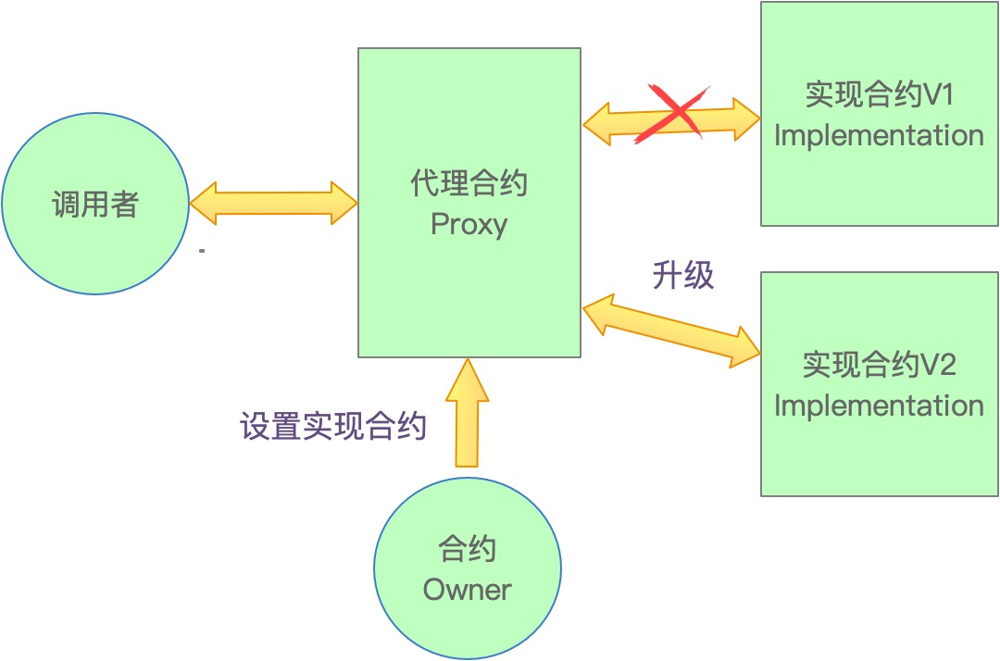

# 土狗合约:&nbsp;&nbsp;&nbsp;&nbsp;04.代理合约欺诈

本视频讲解利用 **`代理合约`** 进行欺诈的原理和应对方法。通过本视频，您可以学习到 **`代理合约`**、可升级合约的原理和开发，以及如何应对土狗合约的欺骗手段。

**视频**：[Bilibili](https://www.bilibili.com/video/BV1F8411d7rU)  |  [Youtube](https://youtu.be/oJQJ2VKt7vY)
<p align="center"></p>

**官网**：[BinSchoolApp](https://binschool.app)

**代码**：[github.com/binschoolapp/rug-pull-contract](https://github.com/binschoolapp/rug-pull-contract)

**推特**：[@BinSchoolApp](https://twitter.com/BinSchoolApp)    **Discord**：[BinSchoolApp](https://discord.gg/PB2YEvggWq)   **微信**：bkra50 

-----
在讲解土狗合约欺诈之前，我们必须先要了解 **`代理合约`** 的有关知识。

## 1. 代理合约的产生原因

区块链的典型特征之一是不允许修改已经上链的数据，这是为了确保区块链数据的安全性和不可篡改性。基于此，智能合约一旦发布到区块链上，它的代码就无法再被修改，功能就被固定。这也有效地防止了直接通过修改已发布的智能合约进行欺诈。

然而，在现实世界中，所有计算机程序，包括智能合约，不可能没有缺陷，如果出现 **`Bug`**，就需要进行修复。此外，在使用过程中，用户会提出一些改进需求，需要项目方修改代码来提升体验。这就导致了现实需求与区块链特性之间的矛盾：现实需求需要修改代码，而区块链又不允许修改已上链的数据。

那么，如何解决这两者的矛盾呢？通常的解决方法是要放弃旧的合约，再部署一个经过修改的新的合约。很显然，这种方案并不完美，甚至不可接受。

你想想，如果你的合约面向的是广大用户，你已经投入大量成本来宣传你的合约，告知用户你的合约地址，用户也已经使用了该地址。突然有一天，你又部署了新的合约，就有了一个新的合约地址。这就意味着你需要再次投入成本，逐个通知用户，要启用新的合约地址。

这个代价是不是太大了呢？那么，是否还存在更好的解决方案，能够同时满足这两方面的要求呢？答案是肯定的，这就是使用代理模式来编写合约。

 **`代理合约`** 并非是新鲜事物，在各种编程语言中都有这方面的需求和解决办法。因此，有人将这一普适性的解决方案进行总结，形成了一个专门的设计模式，即代理模式。在智能合约领域， **`代理合约`** 便是这一设计模式在此领域的具体实现。

## 2. 代理合约的组成
代理合约模式的基本思路是将合约的功能分成两部分： **`代理合约`** 和 **`实现合约`** 。

<p align="center"></p>

### 2.1 代理合约
 **`代理合约`** 充当用户与 **`实现合约`** 之间的中介，它的主要职责是将用户的调用转发给 **`实现合约`** 。

 **`代理合约`** 的代码逻辑很简单，它不包含具体的业务逻辑，只是负责将用户的请求传递给后面的 **`实现合约`** 。

### 2.2 实现合约
 **`实现合约`** 包含了真正的业务逻辑。也就是说，真正的功能都放在 **`实现合约`** 里，它接收 **`代理合约`** 传过来的请求，开始执行，最后把执行结果返给 **`代理合约`** 。

用户调用合约时，会先访问 **`代理合约`** ， **`代理合约`** 再将用户请求转发给 **`实现合约`** 。 **`实现合约`** 执行用户请求，将执行结果返回给 **`代理合约`** ， **`代理合约`** 再将执行结果转发给用户。

## 3. 代理合约的好处

这么做有什么好处呢，中间还多了一层合约，是不是多此一举，搞复杂了呢？我举个现实的例子，帮助你理解一下代理模式的好处。


比如，我有一台电脑，可以用来查看照片。而我的照片呢，存放在手机里。

那么我怎么查看手机上的照片呢？很简单，找一条 **`USB`** 数据线，将电脑和手机连接在一起就可以看了。

如果我的照片存放在一个数码相机里呢？也很简单，把手机拔掉，把相机通过 **`USB`** 口接到数据线上就可以了。

那么我的照片存放在外接硬盘上呢？我们只要把外接硬盘接到数据线上就可以了。

所以说，我只要有这条数据线，凡是提供USB接口的设备，统统都可以访问。

换到代理合约模式上， **`代理合约`** 就是这里的USB数据线，而手机、相机、外接硬盘就是 **`实现合约`** 。

你所有的业务逻辑，也就是实际的功能，都放在 **`实现合约`** 里。而 **`代理合约`** 就起到一个通道作用，负责转发请求和结果。

比如，我们需要编写一个智能合约 **`Hello`**，它要求有一个函数 **`greet`**，调用后输出字符串 “Hello World”。

这个需求非常简单，我们只需要几行代码就可以写出来：

```solidity
// SPDX-License-Identifier: MIT
pragma solidity ^0.8.0;

contract Hello {
  function greet() external pure returns(string memory) {
    return "Hello World";
  }
}
```

将这个合约编译、部署后上链，拿到它在区块链上的合约地址。我们把这个合约地址通知给用户，用户就可以使用这个合约了。

但是过了几天，突然发现不对啊，应该输出的字符串是 “Hello Web3”，而不是 “Hello World”。

这怎么办呢，我们只能修改合约代码，重新部署一个新的合约，然后把新的合约地址再次通知用户。所以，用户量一旦比较多，或者无法掌控的话，对应付出的成本就会很高。

但是，如果我们使用了代理合约模式编写合约，就不会有这个问题了。我们把整个合约分成两个合约来写，一个是 **`代理合约`** ，一个是 **`实现合约`** 。

其中，在 **`实现合约`** 里包含所有的业务逻辑。为了模拟真实的业务场景，我们准备两个 **`实现合约`** ，一个代表旧的 **`实现合约`** ，命名为 **`OldHello`**。这个合约的 **`greet`** 函数，输出“Hello World”。

```solidity
// SPDX-License-Identifier: MIT
pragma solidity ^0.8.0;

contract OldHello {
  function greet() external pure returns(string memory) {
    return "Hello World";
  }
}
```

再写一个新的 **`实现合约`** ，命名为 **`NewHello`**。这个合约的 **`greet`** 函数，输出“Hello Web3”。

```solidity
// SPDX-License-Identifier: MIT
pragma solidity ^0.8.0;

contract NewHello {
  function greet() external pure returns(string memory) {
    return "Hello Web3";
  }
}
```

最后，我们再写一个 **`代理合约`** 。

```solidity
// SPDX-License-Identifier: MIT
pragma solidity ^0.8.0;

interface IHello {
  function greet() external pure returns(string memory);
}

contract Proxy {
  address helloAddress; // 指向一个实现合约

  // 设置实现合约的地址
  function setHello(address _helloAddress) external {
    helloAddress = _helloAddress;
  }

  // 用户使用的接口
  function greet() external view returns (string memory) { 
    return IHello(helloAddress).greet();
  } 
}
```

第一个函数 **`setHello`**，是用来设置 **`实现合约`** 的地址，它把 **`实现合约`** 的地址保存在状态变量 **`helloAddress`** 中。这个函数通常应该由合约拥有者 **`owner`** 调用，其它人是无权使用的。我们为了讲解简单起见，暂时不加限制。

第二个函数 **`greet`**，这就是提供给用户最终使用的函数。它的作用就是将用户的调用，转给 **`helloAddress`** 所指向的 **`实现合约`** ，然后由 **`实现合约`** 去执行，最后把执行结果返给用户。

对于最终用户来说，它只需要记住 **`代理合约`** 的地址，然后调用 **`代理合约`** 的 **`greet`** 方法即可。

至于后面到底使用的是哪个 **`实现合约`** ，他无需知道。 **`代理合约`** 才是他使用的唯一的合约。

所以，我们告诉用户们 **`代理合约`** 的地址，它们只需要使用 **`代理合约`** 就可以了。至于应该输出什么内容，由合约拥有者，也就是超级管理员，去选择设置合适的 **`实现合约`** 。

这是不是很方便呢，修改了 **`实现合约`** 的业务逻辑，而不需要最终用户修改任何东西，他们毫无感知。这就是使用 **`代理合约`** 的模式，来 **`实现合约`** 的可升级。

事实上，很多知名的合约都是使用这种方式，来实现平滑升级的。比如，**`USDT`** 稳定币合约：

```solidity
contract TetherToken is Pausable, StandardToken, BlackList {
    //...
    address public upgradedAddress;
    bool public deprecated;

    function deprecate(address _upgradedAddress) public onlyOwner {
        deprecated = true;
        upgradedAddress = _upgradedAddress;
        //...
    }

    function transfer(address _to, uint _value) public whenNotPaused {
        require(!isBlackListed[msg.sender]);
        if (deprecated) {
            return UpgradedStandardToken(upgradedAddress).transferByLegacy(msg.sender, _to, _value);
        } else {
            return super.transfer(_to, _value);
        }
    }
    //...
}
```

这是它的合约，是不是跟我们的合约非常类似呢？

好了，有了 **`代理合约`** 的知识，我们也就很容易理解土狗合约，如何使用代理模式进行欺诈了。

土狗合约首先是一个 **`ERC20`** 代币合约，有的还会包含与 “去中心化交易所DEX” 的交互功能，比如使用 **`UniSwap`**，或者 **`PancakeSwap`** 等等。

欺诈者会把土狗合约的代码开源，表面看起来很干净，没有问题。而事实上，这个土狗合约是一个 **`代理合约`** ，它会通过 **`代理合约`** 的模式，调用了另外的一个 **`实现合约`** 。而这个 **`实现合约`** 代码并不是开源的，往往隐藏着恶意代码。

比如这个土狗合约：

```solidity
// SPDX-License-Identifier: MIT
pragma solidity ^0.8.0;

import "@openzeppelin/contracts/access/Ownable.sol";
import "@openzeppelin/contracts/token/ERC20/ERC20.sol";

contract ERC20Fake is Ownable,ERC20 {
    address externalAddr; 

    constructor() ERC20("MyCoin", "MC") {
        _mint(msg.sender, 10**26);
    }

    function setExternalAddress(address _externalAddr) public onlyOwner {
        externalAddr = _externalAddr;
    }

   function transfer(address to, uint256 amount) public override returns (bool) {
        return IERC20(externalAddr).transfer(to, amount);
    } 
}
```

欺诈者可以通过调用 **`setExternalAddress`** 函数注入一个恶意合约的地址。

然后在 **`tranfer`** 函数里，偷偷摸摸地夹杂调用了这个恶意合约的 **`tranfer`**。而这个恶意合约的 **`tranfer`**，可以在里面偷走你的代币。

当然，有的时候也未必是严格的代理合约模式，可能使用了更简单的方法，给土狗合约注入一个恶意的外部合约地址，达到同样的目的。这些手段的原理都差不多。

所以，在土狗合约中，对于里面使用外部的合约地址，或者能够注入外部的合约地址，就要小心了，多半是黄鼠狼给鸡拜年。这种欺诈手段，很多检测工具是检测不出来的，因为它根本无法知道，注入的外部地址到底是干嘛的。

当然，最保险的方法还是管住自己的爪子，远离土狗。